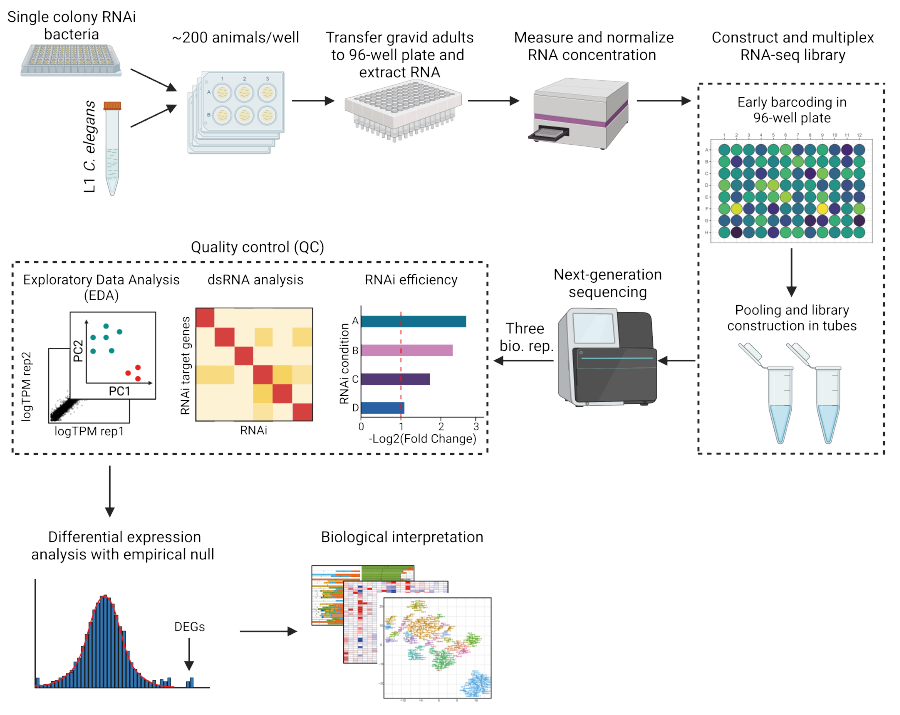

# Worm Perturb-seq (WPS)
Please note that we are still actively improving this pipeline. Please contact us if you encounter any issues!
------------------------------------------------------------------------

This repository provides a data processing pipeline for Worm Perturb-Seq (WPS) technology.
# Introduction
**WPS** is an end-to-end massively parallel RNAi and RNA-seq technology in model animal _C. elegans_. WPS involves both an experimental and computational pipeline that seamlessly cover the process from culturing animals to identifying differentially expressed (DE) genes in each perturbation. The workflow is summarized in the following figure:

This repository details the procedures to process WPS data, starting from fastq files generated by NGS sequencing to the production of DE genes in each condition. 

To find out more details about **WPS**, please read our manuscript:

Hefei Zhang#, Xuhang Li#, Dongyuan Song, Onur Yukselen, Shivani Nanda, Alper Kucukural, Jingyi Jessica Li, Manuel Garber & Albertha J. M. Walhout, **Worm Perturb-Seq: massively parallel whole-animal RNAi and RNA-seq.** _**Nature Communications**_ 2025
[available here](https://www.nature.com/articles/s41467-025-60154-0)

# Table of contents
1. [Dependencies](#dependencies-)
2. [Walkthrough](#walkthrough)
3. [Contact](#contact)
4. [Related Manuscripts](#related-manuscripts)

## Dependencies

WPS data processing involves multiple tools and requires considerable computational power. We recommend setting up an UNIX-based local server or using a computational cluster for processing the data (__caution__: Windows server may encounter problems in installing some dependencies such as pysam package in Python). 

__Softwares__
* Via Foundry: the raw data processing uses a pre-built dolphinNext pipeline for the ease of use and for easy management of large-scale data. Please register at [Via Foundry](https://viafoundry.umassmed.edu) before you start. If you intend to process the raw data (e.g., aligning the reads to genome) manually, please see [1_process_the_raw_data](step1_process_raw_data/) for more information (but you will need to install more dependencies that are not included in this list). We strongly recommend using the dolphinNext pipeline for the sake of reproducibility and robustness.
* Python 2.7
* R > 3.5

## Walkthrough

The pipeline includes three major steps: [__step 1__: process raw data](step1_process_raw_data), [__step 2__: data quality control](step2_quality_control), and [__step 3__: data analysis](step3_data_analysis). Please see the instruction within each module for running a test.

The followings are descriptions on each major step:

[__step 1__: process raw data](step1_process_raw_data): This step illustrates how to process raw reads (fastq files) generated from NGS sequencer. The folder contains a real-data showcase on processing one WPS library using **Via Foundry** platform and our pre-bulit pipeline.

[__step 2__: data quality control](step2_quality_control): This step takes the files generated in __step 1__ and performs two complementary quality control (QC) analyses, the RNAi identity QC and sample QC. This QC step is essential to ensure research rigor of downstream data interpretation and involves interative correction of problems in the dataset. The folder includes a real-data showcase using dataset from metabolic WPS plate 7. 

[__step 3__: data analysis](step3_data_analysis): This step is a simple showcase on performing differential expression analysis using WPS DE framework. It also works as a template showing how downstream analyses can be seamlessly integrated into the framework of WPS data analysis pipeline.

## Contact

Any questions or suggestions on `WPS` are welcomed! Please report it on [issues](https://github.com/XuhangLi/WPS/issues), or contact Xuhang Li ([xuhang.li@umassmed.edu](mailto:xuhang.li@umassmed.edu)).

## Related Manuscripts
-  **WPS** technology is the foundation method of three back-to-back papers. For further reading, please see: 
    -   **WPS method paper**: Worm
Perturb-Seq: massively parallel whole-animal RNAi and RNA-seq. <em>Nature Communications </em> (2025).([available here](https://www.nature.com/articles/s41467-025-60154-0))
    -   **Metabolic rewiring story**: Systems-level design
principles of metabolic rewiring in an animal. <em>Nature</em> (2025).([online link](https://www.nature.com/articles/s41586-025-08636-5))
    -   **Metabolic wiring story**: A systems-level,
semi-quantitative landscape of metabolic flux in C. elegans. <em>Nature</em> (2025).([online link](https://www.nature.com/articles/s41586-025-08635-6))

## Acknowledgement
We thank members of the Walhout lab, Mike Lee, and Chad Myers for discussion and critical reading of the manuscript. We thank former Garber lab members, Kyle Gellatly and Rachel Murphy, for their help in the early stage of this project. This work was supported by grants from the National Institutes of Health GM122502 and DK068429 to A.J.M.W., U01HG012064 to M.G., and NSF DBI-1846216 and NIGMS R35GM140888 to J.J.L.
